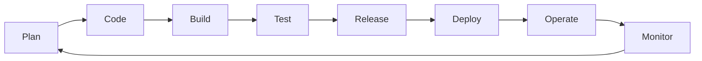
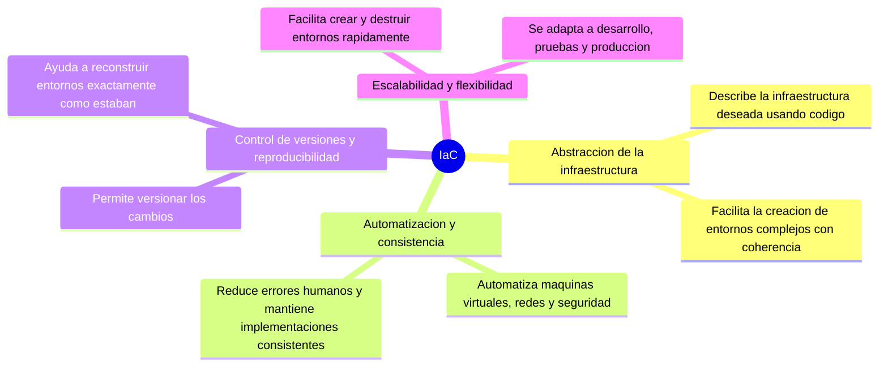

# Notas de clase


## Clase 3/20.

Caracteristicas del DevOps:
* Concepto del 2009.
* Es un concepto de mejora continua que involucra cada uno de los aspectos de TI y procesos de desarrollo.
* Se enfoca en relacionar las personas, los procesos y las herramientas.

Entonces: A partir de una buena definición de proceso y un buen kit de herramientas se realicen soluciones optimas para la mejora de los procesos. 

Hay una relación directa del Agilismo con la cultura DevOps, pues este ultimo es un pilar fundamental para apalancar los despliegues continuos y rapidos.

DevOps no es: 
* Un puesto de trabajo.
* Una herrmaienta.
* Una metodología ágil.
* Una tecnología.
* Un rol.

DevOps es una cultura que converge entre las personas, las herramientas y los procesos.

Herramientas que utilizan esta cultura:
Azure
Jira
gitLab y GitHub (GitHub action)
Jenkins

Entonces DevOps va de la mano con:
* Agilismo.
* Automatización.
* Soporte de infraestructura.
* Integración continua y despliegue continuo.

Grafico resumen del objetivo de automatización del ciclo DevOps:


### Proceso DevOps - ciclo de vida (versión texto)

El diagrama es un símbolo de infinito dividido en dos mitades que representan un ciclo continuo sin fin:

- **Dev** (mitad izquierda, sentido antihorario): `Plan -> Code -> Build -> Test`
- **Release** (punto de cruce entre ambas mitades, pasa de Dev a Ops)
- **Ops** (mitad derecha, sentido horario): `Deploy -> Operate -> Monitor`, y vuelve a cerrar el ciclo hacia `Plan`

Secuencia completa del ciclo/bucle OODA:

```
Plan -> Code -> Build -> Test -> Release -> Deploy -> Operate -> Monitor -> (vuelve a Plan)
```



*Bucle OODA en la práctica:*
- Observe: Supervisión de métricas empresariales, tendencias de mercado, comportamiento del usuario y datos de telemetría.
- Oriente: Analiza opciones para lo que puedes ofrecer, posiblemente a través de experimentos.
- Decidir: determinar qué perseguir en función de los datos y las prioridades empresariales.
- Acto: Entrega de software de trabajo a usuarios reales y recopilación de comentarios.

*Ejercicio de cálculo del tiempo de ciclo:* Piense en el proceso de desarrollo actual. Cuánto tiempo tarda en ir de:
- ¿Confirmación de código → implementación de producción?
- ¿Solicitud de características → comentarios del cliente?
- Informe de errores → ¿Corregir en producción?

*Ejemplo:* Si tardamos 2 semanas en implementar un cambio de configuración de una sola linea. Entonces, el timepo de ciclo es de 2 semanas. Esto se convierte en una restricción de velocidad.

Frase interesante: *Sé informado por los datos, no completamente dirigido por datos.*

Informar para la toma de decisiones y no quedarse estancado en el análisis. Alguna implementaciones seran malas, otras buenas y otras no aportaran nada aparentemente medible. A lo que se refiere esto es que hay que dejarse de tanto pereque, interpretar y ejecutar otro ciclo guiado de: *Fallar rapido en las iniciativas que no avanzan en los objetivos empresariales y redoblar los esfuerzos en los resultados que apalancan los objetico

Link de mucho interés: https://learn.microsoft.com/es-es/azure/devops/get-started/?view=azure-devops

AZURE DevOps:
- Es la suite DevOps de Microsoft.
- Cabe resaltar que Microsoft en dueña de GitHub y son productos complementarios. SOn enfoques distintos.
- Antes Azure DevOps era Visual Studio Online. 
- Cubre todo el proceso de desarrollo.
- Se integra con multicloude (AWS, Azure, GCP).
- Versión: Azure DevOps Server - Esto permite instalar en la propia infraestructura de la empresa los servicios de A. DevOps. Tiene sus limitantes pero a veces esto le conviene a algunas compañias con politicas de seguridad estrictas.


Principales herramientas de Azure DevOps:

* Azure Boards

Herramientas de planeación ágiles

Mantenga un seguimiento del trabajo con paneles kanban, registros de trabajo pendiente interactivos y herramientas de planeamiento muy eficaces. Los informes y la rastreabilidad sin igual convierten a Boards en el lugar perfecto para todas sus ideas, grandes o pequeñas.

----------------------------------------------
* Azure Repos

Repositorios privados gratuitos ilimitados

Consiga un excelente hospedaje GIT, flexible y con revisiones de código muy eficaces, así como repositorios gratuitos ilimitados para todas sus ideas, desde un proyecto de una sola persona hasta el repositorio más grande del mundo.
----------------------------------------------

* Azure Pipelines

CI/CD para cualquier plataforma

Compile, pruebe e implemente soluciones con cualquier lenguaje, en cualquier nube o en el entorno local. Ejecute archivos en paralelo en Linux, macOS y Windows, e implemente contenedores en hosts individuales o en Kubernetes.
----------------------------------------------

* Azure Artifacts

Repositorio de paquetes universal

Comparta paquetes Maven, npm, NuGet y Python de orígenes públicos y privados con todo su equipo. Integre el uso compartido de paquetes en sus canalizaciones de CI/CD de una forma sencilla y escalable.
----------------------------------------------

* Azure Test Plans

Pruebas manuales y exploratorias

Realice pruebas periódicas y publique versiones con confianza. Mejore la calidad global del código con herramientas de pruebas manuales y exploratorias para sus aplicaciones.


#################################
# CONTROL DE VERSIONES
#################################

UTILIZAR HERRAMIENTAS DE OCNTROL DE VERSIONES EN EL DESARROLLO DE SOFTWARE BRINDA BENEFICIOS COMO UN HISTORIAL COMPLETO DE CAMBIOS, FACILIDAD DE COLABORACIÓN, GESTIÓN DE CONFLICTOS Y CAPACIDAD DE ROLLBACK. Por otro lado, no utilizar estas herramientas puede generar problemas como la perdida de cambios, dificultades en la colaboración, falta de seguimiento y trazabilidad, así como el riesgo de pérdida de código. Por lo tanto, es altamente recomendable utilizar herramientas de control de versiones para mejorar la eficiencia y la calidad del desarrollo de software.
Las principales herramientas son:
* GIT: COntrol de versiones distribuida (main+ramas+clones).
* SUBVERSION(SVN): Control de versiones centralizada(main).
* MERCURIAL: Control de versiones distribuida.

#################################
# AUTOMATIZACIÓN DE PRUEBAS Y DESPLIEGUE
#################################
Beneficios de la automatización de pruebas y despliegue de software:

* Eficiencia y ahorro de tiempo: La automatización de pruebas y despliegue de software permite ejecutar pruebas de manera rápida y repetible, lo que ahorra tiempo y recursos. Las pruebas automatizadas se pueden ejecutar automáticamente, lo que reduce la dependencia de las pruebas manuales y permite a los equipos de desarrollo liberar software de manera más rápida y frecuente. 
* Mayor cobertura de pruebas: La automatización de pruebas permite realizar pruebas exhaustivas en diferentes escenarios y configuraciones, lo que ayuda a garantizar una mayor cobertura de pruebas. Esto significa que se pueden identificar y solucionar problemas de manera más efectiva antes de que el software se despliegue en producción. 
* Detección temprana de errores: Al automatizar las pruebas, es posible detectar errores y problemas de manera temprana en el ciclo de desarrollo. Esto permite a los equipos abordar los problemas rápidamente y evitar la propagación de errores a lo largo del proceso de desarrollo, lo que ahorra tiempo y esfuerzo en la resolución de problemas más adelante. 
* Consistencia y confiabilidad: Las pruebas automatizadas aseguran que las pruebas se realicen de manera consistente y confiable. Elimina la posibilidad de errores humanos y garantiza que las pruebas se realicen siguiendo un proceso estandarizado, lo que mejora la calidad del software entregado.

1.2. Problemas asociados con la falta de automatización de pruebas y despliegue:

* Retrasos en el tiempo de entrega: Si las pruebas y el despliegue de software se realizan manualmente, puede llevar mucho tiempo completar estas tareas. Esto puede resultar en retrasos en la entrega del software y afectar la capacidad de respuesta del equipo de desarrollo.
* Errores humanos: Las pruebas manuales están sujetas a errores humanos, ya sea por omisión, falta de atención o inconsistencias en el proceso. Esto puede llevar a la introducción de errores en el software y afectar negativamente su calidad.  
* Falta de cobertura de pruebas adecuada: Las pruebas manuales tienden a ser limitadas en términos de cobertura y pueden pasar por alto ciertos escenarios y configuraciones críticas. Esto puede resultar en la falta de detección de errores importantes y afectar la estabilidad y confiabilidad del software.  
* Mayor costo y esfuerzo: Las pruebas manuales requieren más recursos humanos y tiempo, lo que puede aumentar los costos y la carga de trabajo. Además, la falta de automatización puede generar la necesidad de repetir pruebas en cada ciclo de desarrollo, lo que implica un mayor esfuerzo y consume recursos valiosos.  

En resumen, la automatización de pruebas y despliegue de software brinda beneficios como la eficiencia, el ahorro de tiempo, mayor cobertura de pruebas, detección temprana de errores, consistencia y confiabilidad. Por otro lado, la falta de automatización puede resultar en retrasos en el tiempo de entrega, errores humanos, falta de cobertura de pruebas adecuada y mayor costo y esfuerzo. Por lo tanto, es altamente recomendable automatizar estas tareas para mejorar la eficiencia, la calidad y la entrega de software.

#################################
# HERRAMIENTAS DE INTEGRACIÓN CONTINUA (CI - CONTINUOUS INTEGRATION) Y ENTREGA CONTINUA (CD - CONTINUOUS DELIVERY)
#################################
Las herramientas de integración continua (CI) y entrega continua (CD) ofrecen una serie de beneficios significativos en el desarrollo de software:  

1. Detección temprana de errores: La CI permite la integración automática y regular del código, lo que ayuda a identificar problemas rápidamente, antes de que se conviertan en problemas más grandes.  
2. Entrega más rápida: La automatización en la CD reduce el tiempo entre la escritura del código y su implementación, permitiendo actualizaciones más frecuentes y ágiles.  
3. Mejora en la calidad del software: La ejecución continua de pruebas asegura la calidad del código, lo que reduce la presencia de errores en el producto final.  
4. Facilita la colaboración: La CI fomenta un entorno en el que varios desarrolladores pueden trabajar en el mismo proyecto sin problemas, ya que sus cambios se integran automáticamente.  
5. Mayor eficiencia y productividad: Al automatizar tareas repetitivas como pruebas, compilación y despliegue, los equipos pueden centrarse en tareas más creativas y estratégicas.

Los inconvenientes de no utilizar estas herramientas pueden ser bastante significativos: 
1. Mayor propensión a errores: Sin CI/CD, los errores pueden pasar desapercibidos durante mucho tiempo, lo que resulta en costosos errores de último minuto o en problemas que solo se descubren en etapas avanzadas del desarrollo. 
2. Procesos manuales lentos: Sin automatización, las pruebas, compilaciones y despliegues requieren más tiempo y esfuerzo humano, lo que ralentiza el proceso de desarrollo. 
3. Menor flexibilidad y agilidad: La falta de CI/CD puede hacer que los equipos sean menos ágiles para adaptarse a cambios rápidos o implementar actualizaciones frecuentes, lo que afecta la competitividad y la capacidad de respuesta. 
4. Dificultades en la colaboración: La integración manual del código puede llevar a conflictos entre versiones, dificultando la colaboración entre desarrolladores y generando más trabajo para resolver discrepancias. 

En resumen, la implementación de herramientas de CI/CD ayuda a mejorar la calidad, la velocidad y la eficiencia del desarrollo de software, mientras que la falta de estas herramientas puede resultar en problemas que afectan directamente la calidad del producto final y la eficiencia del equipo de desarrollo.

**Herramientas de Integración Continua (CI):**
1. Jenkins: Es una de las herramientas CI más populares y de código abierto. Permite la integración continua de forma automatizada y es altamente personalizable mediante plugins.
2. Travis CI: Es una plataforma de CI en la nube que se integra fácilmente con repositorios de GitHub. Es conocida por su sencillez de uso y configuración.
3. CircleCI: Ofrece CI/CD en la nube, con soporte para una variedad de lenguajes y frameworks. Proporciona una configuración basada en archivos y una amplia gama de opciones de personalización.
4. GitLab CI/CD: Integrado directamente en GitLab, ofrece un flujo de trabajo de CI/CD que permite a los equipos construir, probar y desplegar proyectos de forma automática. 
5. TeamCity: Ofrece una solución CI potente y fácil de usar, con integración con múltiples herramientas y plataformas.

**Herramientas de Entrega Continua (CD):**
1. Ansible: Automatiza el aprovisionamiento, la configuración y el despliegue de aplicaciones. Se utiliza para orquestar y administrar infraestructuras. 
2. Docker: No es específicamente una herramienta de CD, pero es fundamental para la implementación continua. Proporciona contenedores que simplifican la implementación y portabilidad de aplicaciones.
3. Spinnaker: Diseñada originalmente por Netflix, es una plataforma de CD de código abierto que permite la implementación continua en múltiples nubes.
4. AWS CodePipeline: Es un servicio de AWS que permite orquestar y automatizar la entrega continua de manera sencilla dentro del ecosistema de Amazon Web Services.
5. Google Cloud Build: Herramienta de Google Cloud Platform que permite crear, probar y desplegar aplicaciones de forma automática en la nube.
6. Microsoft Azure Pipeline: es la solución de Microsoft integrada a su plataforma de gestión de equipos Azure, funciona de forma similar al pipeline de AWS. 

Estas herramientas son solo algunas de las disponibles, y su elección dependerá de las necesidades específicas del proyecto, la infraestructura utilizada y las preferencias del equipo de desarrollo.

#################################
# INFRAESTRUCTURA COMO CÓDIGO (IaC) Y HERRAMIENTAS
#################################
La infraestructura como código (IaC) es una metodología que consiste en manejar y gestionar la infraestructura de sistemas informáticos utilizando código, en lugar de configuraciones manuales o procesos interactivos. Básicamente, es aplicar los principios de desarrollo de software al manejo de la infraestructura.
En lugar de configurar servidores, redes o cualquier otro componente de la infraestructura de manera manual, se utiliza código para definir y automatizar estos recursos. Esto se logra mediante el uso de lenguajes de programación específicos o herramientas diseñadas para este propósito, como Terraform, AWS CloudFormation, Ansible o Chef, entre otros. 

**Aspectos relevantes.**


Resumen:
- **Abstraccion de la infraestructura:** permite describir la infraestructura deseada utilizando codigo.
- **Automatizacion y consistencia:** ayuda a automatizar tareas repetitivas y evita errores humanos.
- **Control de versiones y reproducibilidad:** permite rastrear cambios y reconstruir entornos con precision.
- **Escalabilidad y flexibilidad:** facilita ajustar la infraestructura segun las necesidades del proyecto.

La infraestructura como código es una práctica que utiliza código para definir, configurar y administrar la infraestructura de manera automatizada y escalable, mejorando la eficiencia, la consistencia y la agilidad en el despliegue y gestión de sistemas informáticos. 

**Cuando no se utiliza IaC, pueden surgir varios problemas:**
1. Inconsistencia: La infraestructura manual tiende a ser inconsistente, ya que las configuraciones pueden variar entre diferentes entornos (desarrollo, pruebas, producción). Esto puede provocar errores inesperados y dificultar la replicación de entornos. 
2. Dificultad en la gestión: Gestionar manualmente la infraestructura es más propenso a errores y más lento en términos de implementación y cambios. Esto puede causar problemas de tiempo de inactividad y retrasos en la entrega. 
3. Falta de trazabilidad y documentación: Sin IaC, es más difícil mantener un registro claro de los cambios en la infraestructura y entender cómo se configuró un entorno en particular. Esto puede complicar la resolución de problemas y la colaboración entre equipos. 
4. Mayor riesgo de errores humanos: La configuración manual aumenta la posibilidad de cometer errores durante la implementación o la actualización de la infraestructura, lo que puede tener repercusiones costosas en términos de tiempo y recursos.

En resumen, adoptar prácticas de infraestructura como código proporciona consistencia, agilidad y eficiencia en el desarrollo y gestión de la infraestructura, mientras que la falta de uso puede llevar a problemas de consistencia, errores humanos y dificultades en la gestión y mantenimiento.

Existen varias herramientas de infraestructura como código, cada una con sus fortalezas y casos de uso específicos. Aquí te presento algunas de las principales:
1. Terraform: Es una herramienta ampliamente utilizada y agnóstica de proveedor, lo que significa que puedes usarla para gestionar recursos en múltiples plataformas (AWS, Azure, Google Cloud, entre otros). Es ideal cuando se requiere trabajar con entornos heterogéneos o migrar entre proveedores en el futuro. Terraform utiliza archivos de configuración declarativos (llamados archivos HCL) para describir la infraestructura.
2. AWS CloudFormation: Es específica de Amazon Web Services (AWS) y se utiliza para definir y desplegar recursos en la nube de AWS. Si te enfocas exclusivamente en AWS, CloudFormation puede ser una elección sólida, ya que está integrada completamente en el ecosistema de AWS. 
3. Azure Resource Manager (ARM) Templates: Similar a CloudFormation pero para Microsoft Azure. Permite describir y desplegar recursos en Azure utilizando archivos de plantilla JSON. Si trabajas principalmente en Azure, esta puede ser la opción más natural.
4. Ansible: Aunque es conocida principalmente como una herramienta de automatización de configuración, Ansible también se puede utilizar para manejar la infraestructura como código. Es agente-less y utiliza YAML para describir configuraciones. Es particularmente útil para la configuración de software y el despliegue en múltiples nodos. 
5. Chef y Puppet: Estas herramientas se centran más en la configuración y gestión de la infraestructura en sistemas y servidores. Son excelentes para configuraciones complejas y gestionar el estado deseado de los sistemas a lo largo del tiempo.


**La elección de la herramienta depende de varios factores:**
*  Entorno de nube específico: Si estás comprometido con un proveedor de nube específico, como AWS o Azure, su herramienta nativa (CloudFormation o ARM) puede ser la mejor opción debido a su integración y compatibilidad. 
* Requerimientos de multi-cloud o portabilidad: Si necesitas trabajar en múltiples nubes o mantener la capacidad de cambiar fácilmente entre proveedores, Terraform puede ser más adecuada debido a su agnosticismo de proveedor.
* Habilidades y preferencias del equipo: La experiencia del equipo en una herramienta específica puede influir en la elección. Es posible que un equipo que ya esté familiarizado con Ansible, Chef o Puppet prefiera seguir utilizando esas herramientas.

En última instancia, la mejor herramienta depende de las necesidades específicas del proyecto, el entorno de implementación y las habilidades del equipo.

