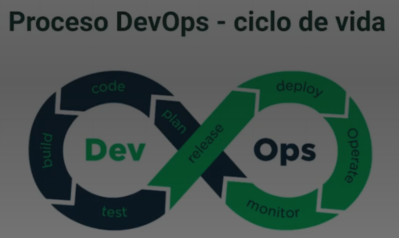
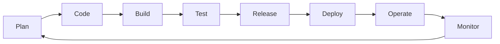

# Notas de clase


## Clase 3/20.

Caracteristicas del DevOps:
* Concepto del 2009.
* Es un concepto de mejora continua que involucra cada uno de los aspectos de TI y procesos de desarrollo.
* Se enfoca en relacionar las personas, los procesos y las herramientas.

Entonces: A partir de una buena definición de proceso y un buen kit de herramientas se realicen soluciones optimas para la mejora de los procesos. 

Hay una relación directa del Agilismo con la cultura DevOps, pues este ultimo es un pilar fundamental para apalancar los despliegues continuos y rapidos.

DevOps no es: 
* Un puesto de trabajo.
* Una herrmaienta.
* Una metodología ágil.
* Una tecnología.
* Un rol.

DevOps es una cultura que converge entre las personas, las herramientas y los procesos.

Herramientas que utilizan esta cultura:
Azure
Jira
gitLab y GitHub (GitHub action)
Jenkins

Entonces DevOps va de la mano con:
* Agilismo.
* Automatización.
* Soporte de infraestructura.
* Integración continua y despliegue continuo.

Grafico resumen del objetivo de automatización del ciclo DevOps:


### Proceso DevOps - ciclo de vida (versión texto)

El diagrama es un símbolo de infinito dividido en dos mitades que representan un ciclo continuo sin fin:

- **Dev** (mitad izquierda, sentido antihorario): `Plan -> Code -> Build -> Test`
- **Release** (punto de cruce entre ambas mitades, pasa de Dev a Ops)
- **Ops** (mitad derecha, sentido horario): `Deploy -> Operate -> Monitor`, y vuelve a cerrar el ciclo hacia `Plan`

Secuencia completa del ciclo/bucle OODA:

```
Plan -> Code -> Build -> Test -> Release -> Deploy -> Operate -> Monitor -> (vuelve a Plan)
```



*Bucle OODA en la práctica:*
- Observe: Supervisión de métricas empresariales, tendencias de mercado, comportamiento del usuario y datos de telemetría.
- Oriente: Analiza opciones para lo que puedes ofrecer, posiblemente a través de experimentos.
- Decidir: determinar qué perseguir en función de los datos y las prioridades empresariales.
- Acto: Entrega de software de trabajo a usuarios reales y recopilación de comentarios.

*Ejercicio de cálculo del tiempo de ciclo:* Piense en el proceso de desarrollo actual. Cuánto tiempo tarda en ir de:
- ¿Confirmación de código → implementación de producción?
- ¿Solicitud de características → comentarios del cliente?
- Informe de errores → ¿Corregir en producción?

*Ejemplo:* Si tardamos 2 semanas en implementar un cambio de configuración de una sola linea. Entonces, el timepo de ciclo es de 2 semanas. Esto se convierte en una restricción de velocidad.

Frase interesante: *Sé informado por los datos, no completamente dirigido por datos.*

Informar para la toma de decisiones y no quedarse estancado en el análisis. Alguna implementaciones seran malas, otras buenas y otras no aportaran nada aparentemente medible. A lo que se refiere esto es que hay que dejarse de tanto pereque, interpretar y ejecutar otro ciclo guiado de: *Fallar rapido en las iniciativas que no avanzan en los objetivos empresariales y redoblar los esfuerzos en los resultados que apalancan los objetico

Link de mucho interés: https://learn.microsoft.com/es-es/azure/devops/get-started/?view=azure-devops

AZURE DevOps:
- Es la suite DevOps de Microsoft.
- Cabe resaltar que Microsoft en dueña de GitHub y son productos complementarios. SOn enfoques distintos.
- Antes Azure DevOps era Visual Studio Online. 
- Cubre todo el proceso de desarrollo.
- Se integra con multicloude (AWS, Azure, GCP).
- Versión: Azure DevOps Server - Esto permite instalar en la propia infraestructura de la empresa los servicios de A. DevOps. Tiene sus limitantes pero a veces esto le conviene a algunas compañias con politicas de seguridad estrictas.


Principales herramientas de Azure DevOps:

* Azure Boards

Herramientas de planeación ágiles

Mantenga un seguimiento del trabajo con paneles kanban, registros de trabajo pendiente interactivos y herramientas de planeamiento muy eficaces. Los informes y la rastreabilidad sin igual convierten a Boards en el lugar perfecto para todas sus ideas, grandes o pequeñas.

----------------------------------------------
* Azure Repos

Repositorios privados gratuitos ilimitados

Consiga un excelente hospedaje GIT, flexible y con revisiones de código muy eficaces, así como repositorios gratuitos ilimitados para todas sus ideas, desde un proyecto de una sola persona hasta el repositorio más grande del mundo.
----------------------------------------------

* Azure Pipelines

CI/CD para cualquier plataforma

Compile, pruebe e implemente soluciones con cualquier lenguaje, en cualquier nube o en el entorno local. Ejecute archivos en paralelo en Linux, macOS y Windows, e implemente contenedores en hosts individuales o en Kubernetes.
----------------------------------------------

* Azure Artifacts

Repositorio de paquetes universal

Comparta paquetes Maven, npm, NuGet y Python de orígenes públicos y privados con todo su equipo. Integre el uso compartido de paquetes en sus canalizaciones de CI/CD de una forma sencilla y escalable.
----------------------------------------------

* Azure Test Plans

Pruebas manuales y exploratorias

Realice pruebas periódicas y publique versiones con confianza. Mejore la calidad global del código con herramientas de pruebas manuales y exploratorias para sus aplicaciones.
