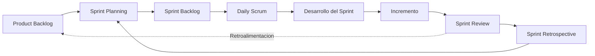

# Curso Scrum

link:

# Notas
#####################

**Artefactos y Compromisos**

* **Product Backlog & Objetivo del Producto:** Lista priorizada y dinamica de todo lo necesario para mejorar el producto. Su compromiso es el *Objetivo del Producto*, la meta a largo plazo que da direccion al desarrollo.

* **Sprint Backlog & Objetivo del Sprint:** Conjunto de elementos seleccionados del Product Backlog para trabajar en el ciclo actual, junto con el plan para entregarlos. Su compromiso es el *Objetivo del Sprint*, la meta concreta a cumplir durante la iteracion.

* **Incremento & Definicion de Hecho (Definition of Done):** El resultado utilizable y funcional producido al finalizar el Sprint. Su compromiso es la *Definicion de Hecho*, el criterio formal de calidad que determina si una tarea esta completamente terminada.

**Eventos Scrum**

**Ciclo Scrum**

* **Sprint Planning:** Reunion al inicio del ciclo donde se responde por que es importante el Sprint, qué se va a hacer y cómo se va a construir.

* **Daily Scrum:** Evento diario de 15 minutos para que el equipo evalue el progreso e inspeccione el avance hacia el Objetivo del Sprint.

* **Sprint Review:** Sesión al final del Sprint donde se muestra el incremento a los interesados (stakeholders) para recibir retroalimentacion.

* **Sprint Retrospective:** Reunion final donde el equipo examina su proceso, herramientas y relaciones para planificar mejoras de trabajo continuo.

**Pilar Transversal**

* **Transparencia:** Principio fundamental que asegura que el proceso, los artefactos y el estado del trabajo sean visibles para todos los involucrados.